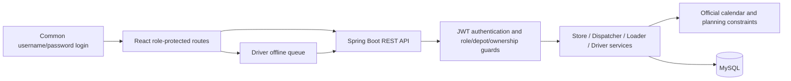
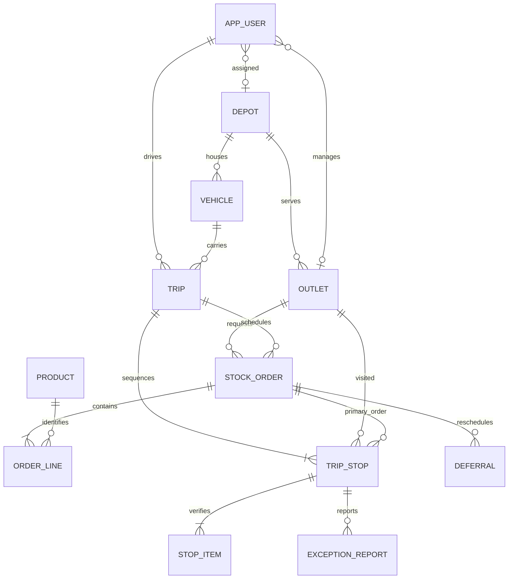

# Architecture and data model

Spring Boot serves the built frontend, so production uses one origin. Railway provides MySQL and the JWT secret. Accounts derive roles from the database; clients cannot choose a role. Missing account configuration is saved after authentication through a role-specific modal.

A mixed cart becomes separate whole ambient/chilled orders. Dispatcher confirmation and constrained allocation precede explicit release to the dock. Release creates trips, stops, expected items, planned ETAs, time totals and weekly fuel reservations. Trip number is unique per vehicle/date. Loader reverses stop sequence, records loaded quantities/conditions, flags shortfalls, verifies, pre-cools refrigerated vehicles and dispatches. Driver owns its trips, starts, completes ordered stops and records POD; offline replay is idempotent. Store receipt confirms quantities and exceptions independently after delivery.

Planning uses the official outbound/inter-stop travel times and per-brand/dock service allowance. Fresh daily work has 270 minutes; combined Style/Tech work has 480 minutes; at most two trips are permitted. Waiting for outlet opening times counts toward the budget. Fuel reserves outbound + inter-stop + return distance divided by vehicle km/L per ISO week. This is deterministic planning; live traffic prediction is not claimed.

## Data storage notes

Stock orders carry outlet, vehicle/trip references, order lines, delivery status and signed receiving fields. A trip stop references the primary order for a visit; additional split orders for the same trip/outlet share that visit through their trip/outlet relationship. Stop items hold expected/loaded quantities, loading condition and delivered damage counts. Driver POD stores recipient/signature, completion timestamps and photo count. Photo image persistence is not implemented for driver POD. Store damage photos and signatures use LONGTEXT. Deferrals and exception reports retain operational reasons/history.

The driver account's vehicle_code resolves its vehicle; trip.driver_id identifies the owning account. The dispatcher-protected driver provisioning endpoint creates a DRIVER account with a hashed password and linked depot/vehicle. Existing driver accounts are not reassigned by that endpoint.
